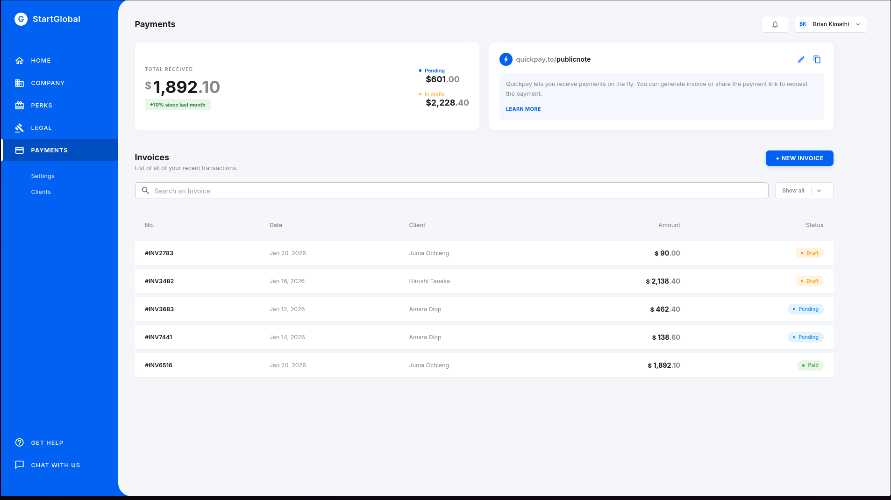

# QuickPay Invoice Management System



A modern, full-stack invoice management application built with Next.js, React, and Supabase. QuickPay provides a streamlined interface for creating, managing, and tracking invoices with real-time data synchronization.

## Table of Contents

- [Features](#features)
- [Technology Stack](#technology-stack)
- [Prerequisites](#prerequisites)
- [Installation](#installation)
- [Configuration](#configuration)
- [Database Setup](#database-setup)
- [Running the Application](#running-the-application)
- [Project Structure](#project-structure)
- [Architecture](#architecture)
- [Development](#development)
- [License](#license)

## Features

### Core Functionality
- **Invoice Management**: Create, view, and track invoices with multiple statuses (Pending, Draft, Paid)
- **Client Management**: Maintain a database of clients with complete contact information
- **Real-time Statistics**: Dynamic calculation of total received, pending, and draft amounts
- **Progressive Loading**: Skeleton screens for smooth user experience during data fetching
- **Search and Filter**: Advanced filtering by status and search by client name or invoice number

### Technical Features
- Server-side data persistence with Supabase
- Redux Toolkit for state management
- Form validation with Zod and React Hook Form
- Material-UI components with custom theming
- TypeScript for type safety
- Responsive design

## Technology Stack

### Frontend
- **Framework**: Next.js 15.4.8 (App Router)
- **UI Library**: React 19.1.0
- **Component Library**: Material-UI (MUI) 7.2.0
- **State Management**: Redux Toolkit 2.11.2
- **Form Handling**: React Hook Form 7.60.0
- **Validation**: Zod 4.3.5
- **Language**: TypeScript 5

### Backend
- **Database**: Supabase (PostgreSQL)
- **ORM**: Supabase JS Client 2.91.0

## Prerequisites

Before you begin, ensure you have the following installed:
- Node.js 18.x or higher
- npm, yarn, or pnpm package manager
- A Supabase account and project

## Installation

1. Clone the repository:
```bash
git clone https://github.com/kimathikim/QuickpayQuiz.git
cd QuickPay
```

2. Install dependencies:
```bash
npm install
# or
pnpm install
# or
yarn install
```

## Configuration

### Environment Variables

Create a `.env.local` file in the root directory:

```env
NEXT_PUBLIC_SUPABASE_URL=your_supabase_project_url
NEXT_PUBLIC_SUPABASE_ANON_KEY=your_supabase_anon_key
```

To obtain these credentials:
1. Log in to your Supabase dashboard
2. Select your project
3. Navigate to Settings > API
4. Copy the Project URL and anon/public key

## Database Setup

### Creating Tables

Execute the following SQL in your Supabase SQL Editor:

```sql
-- Enable UUID extension
create extension if not exists "uuid-ossp";

-- Create clients table
create table if not exists clients (
  id uuid default gen_random_uuid() primary key,
  name text not null,
  email text not null,
  address text,
  city text,
  country text,
  zip text,
  created_at timestamp with time zone default timezone('utc'::text, now()) not null
);

-- Create invoices table
create table if not exists invoices (
  id uuid default gen_random_uuid() primary key,
  invoice_number text not null,
  date text not null,
  client text not null,
  amount numeric not null,
  status text check (status in ('Pending', 'Draft', 'Paid')) not null,
  created_at timestamp with time zone default timezone('utc'::text, now()) not null
);
```

### Sample Data (Optional)

```sql
insert into clients (name, email, address, city, country, zip) values
('Juma Ochieng', 'juma.ochieng@email.com', '45 Moi Avenue', 'Nairobi', 'Kenya', '00100'),
('Wanjiku Kimani', 'wanjiku.kimani@email.com', '12 Kenyatta Lane', 'Nakuru', 'Kenya', '20100'),
('Sarah Jenkins', 'sarah.j@email.com', '123 Oxford Street', 'London', 'United Kingdom', 'W1D 1LL');
```

## Running the Application

### Development Mode

```bash
npm run dev
```

The application will be available at `http://localhost:3000`

### Production Build

```bash
npm run build
npm start
```

### Linting

```bash
npm run lint
```

## Project Structure

```
QuickPay/
├── src/
│   ├── app/                    # Next.js app directory
│   ├── components/
│   │   ├── atoms/             # Basic UI components
│   │   ├── molecules/         # Composite components
│   │   └── organisms/         # Complex components
│   ├── lib/
│   │   ├── schemas.ts         # Zod validation schemas
│   │   ├── supabaseClient.ts  # Supabase configuration
│   │   └── utils.ts           # Utility functions
│   ├── store/
│   │   ├── Dashboard/
│   │   │   └── dashboardSlice.ts  # Redux slice
│   │   ├── hooks.ts           # Typed Redux hooks
│   │   ├── localStorage.ts    # Persistence utilities
│   │   ├── provider.tsx       # Redux provider
│   │   └── store.ts           # Store configuration
│   └── types/
│       └── dashboard.ts       # TypeScript interfaces
├── constants.ts               # Application constants
├── supabase_schema.sql       # Database schema
└── package.json
```

## Architecture

### State Management

The application uses Redux Toolkit for centralized state management:

- **dashboardSlice**: Manages invoices, clients, and loading states
- **Async Thunks**: Handle data fetching and mutations
  - `fetchClients`: Retrieves client list from Supabase
  - `fetchInvoices`: Retrieves invoice list from Supabase
  - `createInvoice`: Creates new invoices in Supabase

### Data Flow

1. Components dispatch async thunks
2. Thunks interact with Supabase
3. Data is transformed (snake_case to camelCase)
4. Redux state is updated
5. Components re-render with new data

### Field Mapping

The application handles case conversion between database and application:

| Database (snake_case) | Application (camelCase) |
|-----------------------|-------------------------|
| invoice_number        | invoiceNumber           |
| created_at            | createdAt               |

### Progressive Loading

Loading states are tracked in Redux:
- `isLoadingInvoices`: Tracks invoice data fetching
- `isLoadingClients`: Tracks client data fetching

Skeleton components provide visual feedback during loading:
- `InvoiceTableSkeleton`: Placeholder for invoice table
- `StatCardSkeleton`: Placeholder for statistics cards

## Development

### Component Organization

Components follow the Atomic Design methodology:
- **Atoms**: Basic building blocks (buttons, icons)
- **Molecules**: Simple component combinations (form fields, cards)
- **Organisms**: Complex components (tables, drawers, forms)

### Type Safety

All components and functions are fully typed with TypeScript. Key interfaces:

```typescript
interface Invoice {
  id: string;
  invoiceNumber: string;
  date: string;
  client: string;
  amount: number;
  status: 'Pending' | 'Draft' | 'Paid';
}

interface Client {
  id: string;
  name: string;
  email: string;
  address: string;
  city: string;
  country: string;
  zip: string;
}
```

### Form Validation

Forms use Zod schemas for validation:
- Email validation
- Required field checks
- Date range validation
- Custom business logic validation
